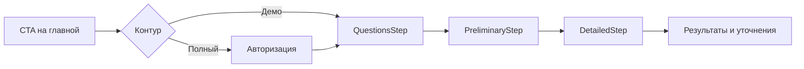
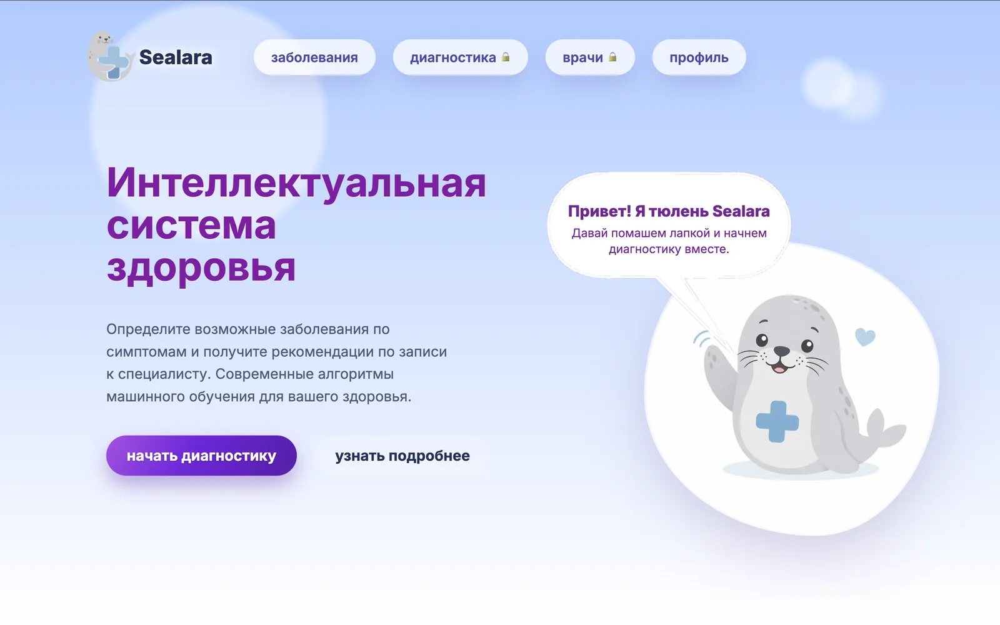
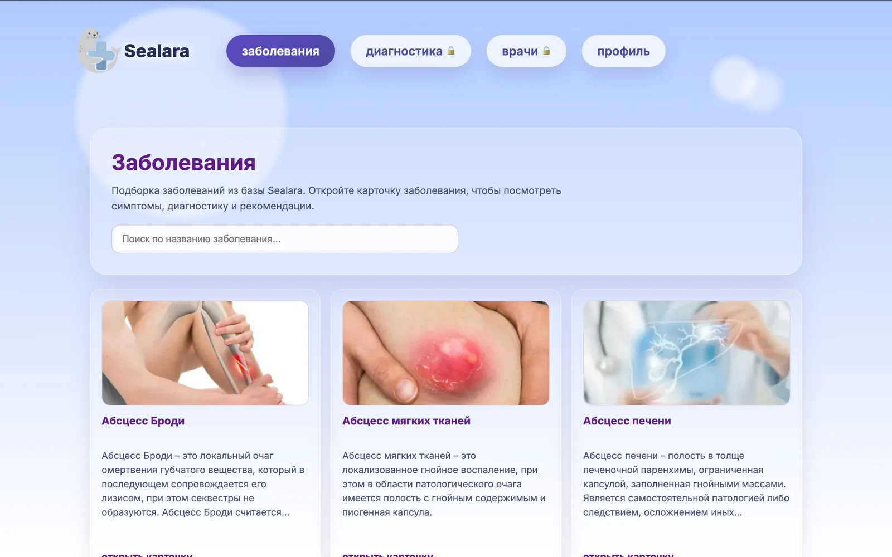
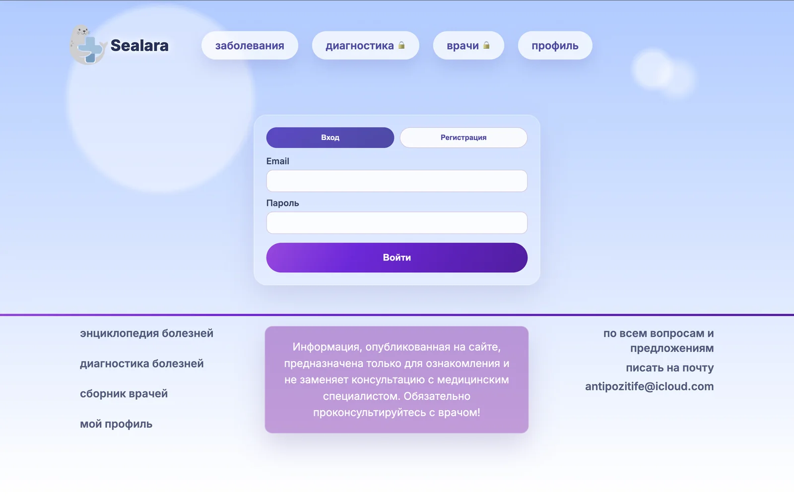
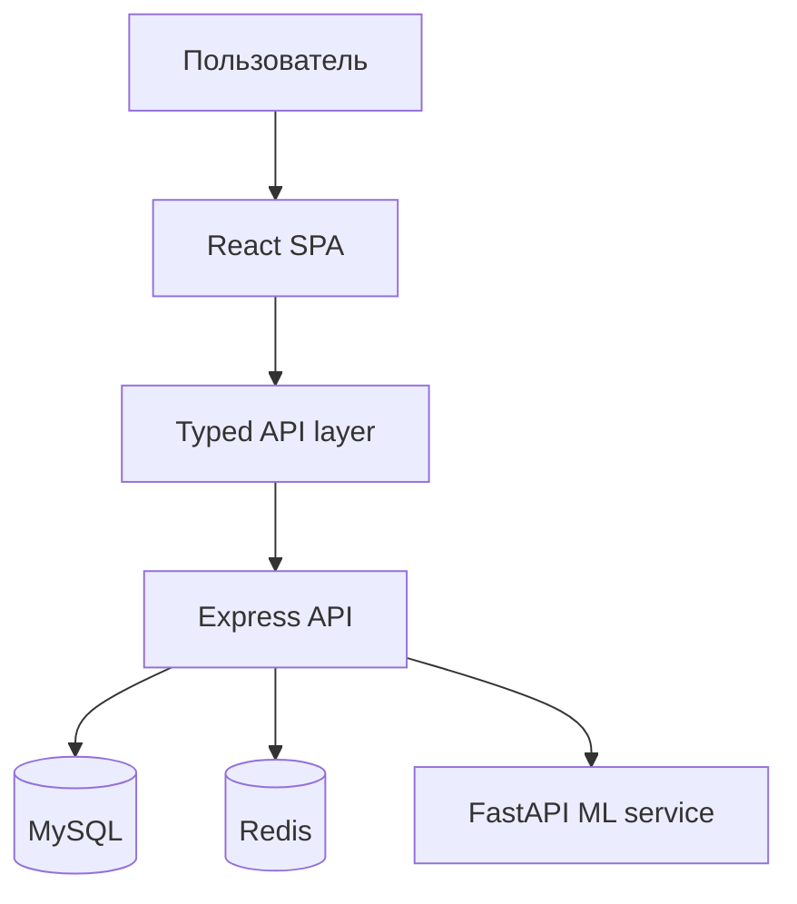

<p align="center">
  
</p>

<h1 align="center">Sealara — React frontend case study</h1>
<h3 align="center">Адаптивное учебное SPA для структурирования симптомов с типизированным API-слоем и тестируемыми пользовательскими сценариями</h3>

<p align="center">
  
  
  
  
</p>

<p align="center"><strong>React architecture · forms and state · API integration · accessibility · responsive UI · performance</strong></p>

<p align="center">
  <a href="https://sealara.vercel.app/"></a>
</p>

> **Важно:** Sealara — учебный программный демонстратор, не предназначенный для медицинского применения. Он не оказывает медицинские услуги, не устанавливает диагноз, не оценивает срочность состояния и не назначает лечение. Автоматические результаты могут быть ошибочными. При угрозе жизни следует звонить 112 или 103.

## Frontend за 30 секунд

| Навык              | Что реализовано                                                                                 | Где смотреть                                                                                                                                                                              |
| ------------------ | ----------------------------------------------------------------------------------------------- | ----------------------------------------------------------------------------------------------------------------------------------------------------------------------------------------- |
| React architecture | Тонкие route-компоненты, custom hooks, декомпозиция по этапам сценария                          | [`DiagnosisPage`](./src/pages/Diagnosis/DiagnosisPage.tsx), [`useDiagnosisFlow`](./src/pages/Diagnosis/useDiagnosisFlow.ts), [`DiagnosisSteps`](./src/pages/Diagnosis/DiagnosisSteps.tsx) |
| Формы и состояние  | Многошаговый опрос, управляемые поля, состояния loading/error/submitting, загрузка аватара      | [`ProfileForm`](./src/pages/Profile/ProfileSections.tsx), [`useProfile`](./src/pages/Profile/useProfile.ts)                                                                               |
| API-слой           | Типизированные DTO, единая обработка ошибок, cookie-сессия, CSRF для мутаций                    | [`auth-api.ts`](./src/lib/auth-api.ts)                                                                                                                                                    |
| Маршрутизация      | React Router, lazy-loaded страницы, демо- и авторизованный контуры, возврат после входа         | [`index.tsx`](./src/index.tsx), [`AuthPage`](./src/pages/Auth/AuthPage.tsx)                                                                                                               |
| Адаптивность       | Responsive grids, мобильная навигация и перестроение форм без отдельной mobile-версии           | [`home.css`](./src/pages/Home/home.css), [`profile.css`](./src/pages/Profile/profile.css)                                                                                                 |
| Доступность        | Семантические секции, labels, keyboard focus, skip-link, ARIA и reduced motion                  | [`Header`](./src/components/header/Header.tsx), [`HomeSections`](./src/pages/Home/HomeSections.tsx)                                                                                       |
| Оптимизация        | Route-level code splitting, vendor chunk, content hashes, WebP и восстановление scroll position | [`webpack.config.cjs`](./webpack.config.cjs), [`useHomeEffects`](./src/pages/Home/useHomeEffects.ts)                                                                                      |
| Проверки           | React Testing Library, strict TypeScript, ESLint, Prettier и production build в одном gate      | [`DiagnosisPage.test.tsx`](./src/pages/Diagnosis/DiagnosisPage.test.tsx), [`package.json`](./package.json)                                                                                |
| UI workshop        | Storybook autodocs, варианты компонентов и автоматический a11y-аудит                            | [`components/ui`](./src/components/ui), [`.storybook`](./.storybook)                                                                                                                      |

### Ключевой пользовательский сценарий

Справочный анализ симптомов доступен в двух контурах:

1. **Демо без регистрации** — пользователь сразу проходит опрос; профиль и история не сохраняются.
2. **Полный режим** — авторизация, персонализированный результат и сохранение истории.

Внутри сценария интерфейс последовательно управляет загрузкой вопросов, ответами, автоматическими справочными совпадениями, выбором симптомов, уточнениями и ошибками API. Workflow инкапсулирован в `useDiagnosisFlow`, а каждый этап отображается отдельным компонентом.



---

## Интерфейс

<a href="https://sealara.vercel.app/">
  
</a>

<table>
  <tr>
    <td width="50%" valign="top">
      
      <br />
      <sub><strong>Поиск и каталог</strong><br />Фильтрация данных и переход к детальным маршрутам</sub>
    </td>
    <td width="50%" valign="top">
      
      <br />
      <sub><strong>Формы</strong><br />Вход, регистрация, валидация и состояния отправки</sub>
    </td>
  </tr>
</table>

Все экраны доступны в [работающем приложении](https://sealara.vercel.app/).

---

## Клиентская архитектура

```text
src/
├── components/               shared layout, error boundary, header, footer
│   └── ui/                   reusable primitives, styles and stories
├── pages/
│   ├── Diagnosis/
│   │   ├── DiagnosisPage.tsx       route composition
│   │   ├── useDiagnosisFlow.ts      state, API and workflow
│   │   └── DiagnosisSteps.tsx       presentational steps
│   ├── Profile/
│   │   ├── ProfilePage.tsx
│   │   ├── useProfile.ts            profile mutations and session
│   │   └── ProfileSections.tsx
│   └── Home/
│       ├── HomePage.tsx
│       ├── useHomeEffects.ts        scroll and intersection effects
│       └── HomeSections.tsx
├── lib/auth-api.ts            typed API boundary
├── styles/                    shared shell and design primitives
└── index.tsx                  routes and lazy loading
```

### Почему такая декомпозиция

- Route-компоненты отвечают только за сборку экрана.
- Custom hooks владеют асинхронными запросами, состояниями и переходами workflow.
- Секционные компоненты получают данные и callbacks через явные props.
- API-вызовы не размазаны по JSX и собраны за единой типизированной границей.
- Поведенческие тесты проверяют пользовательский результат, а не внутреннюю реализацию hooks.

### Управление состоянием

Для локальных сценариев используются `useState`, `useMemo` и специализированные hooks. Глобальный state manager не добавлялся: между экранами нет сложного разделяемого клиентского состояния, а сессия и профиль принадлежат серверу. Это сохраняет поток данных явным и не увеличивает bundle без необходимости.

### API и ошибки

`src/lib/auth-api.ts` содержит типы запросов и ответов, добавляет credentials и CSRF-заголовок, приводит серверные ошибки к `Error` и предоставляет отдельную безопасную проверку сессии. UI различает:

- первичную загрузку;
- отправку формы;
- ошибку запроса;
- пустой результат;
- успешное состояние;
- гостевой и авторизованный доступ.

---

## Адаптивность и доступность

- CSS Grid/Flexbox перестраивают формы, карточки и панели на узких экранах.
- Интерактивные поля связаны с видимыми `label`.
- Доступна skip-link «Перейти к основному содержимому».
- Активный маршрут отмечается через `aria-current`.
- Демо-баннер имеет понятную доступную метку.
- Все основные действия доступны с клавиатуры.
- Анимации учитывают `prefers-reduced-motion`.
- Декоративные изображения и SVG исключены из accessibility tree.

---

## Производительность

- Страницы загружаются через `React.lazy` и `Suspense`.
- Webpack отделяет React vendor chunk от прикладного кода.
- Production-файлы получают content hash для долгого кеширования.
- Изображения поставляются в WebP; общий вес иллюстраций уменьшен примерно с 2,4 МБ до 235 КБ.
- Intersection Observer запускает reveal-анимации только рядом с viewport.
- Scroll position главной страницы восстанавливается без глобального store.

---

## Клиентские тесты и quality gate

React Testing Library проверяет поведение двух контуров справочного анализа:

- деморежим запускается без проверки аккаунта;
- гостевой полный режим перенаправляет на вход с return URL;
- авторизованный пользователь получает персонализированный сценарий.
- полный демопоток до подробного результата проверяется на уровне React и API-mocks.

Playwright отдельно проходит путь от главной страницы до результата в desktop Chromium и мобильном viewport
Pixel 7. API фиксируется на уровне browser network, поэтому E2E не зависит от доступности ML-сервиса.

```bash
npm run test:client   # React Testing Library + jsdom
npm run test:e2e      # Playwright: desktop + mobile Chromium
npm run lint          # ESLint: TypeScript, React Hooks, imports
npm run format:check  # Prettier без изменения файлов
npm run typecheck     # strict TypeScript
npm run build         # production Webpack build
npm run build:storybook # статическая сборка UI workshop
npm run check         # полный quality gate
```

`npm run check` последовательно выполняет Prettier, ESLint, typecheck, клиентские тесты, Storybook build, серверные тесты и production build.

---

## UI-компоненты и Storybook

Переиспользуемые элементы находятся в [`src/components/ui`](./src/components/ui). Компоненты хранят рядом типизированный API, стили и stories:

```text
components/ui/
├── Button.tsx
├── Button.stories.tsx
├── button.css
├── StateMessage.tsx
├── StateMessage.stories.tsx
└── state-message.css
```

`StateMessage` используется в реальных error states опроса и профиля. Для `Button` задокументированы primary, secondary, ghost, disabled и full-width варианты. Storybook генерирует autodocs, а `@storybook/addon-a11y` проверяет истории через axe в строгом режиме.

```bash
npm run storybook        # localhost:6006
npm run build:storybook  # проверка production-сборки stories
```

---

## Lighthouse

В репозитории сохранён исходный mobile-аудит опубликованного интерфейса от **28 июля 2026 года**:

| Категория      | Результат |
| -------------- | --------: |
| Accessibility  |   **100** |
| Best Practices |   **100** |
| SEO            |    **92** |
| Performance    |    **76** |

Этот отчёт зафиксирован как baseline до оптимизации. После удаления внешнего render-blocking шрифта,
уменьшения изображений и lazy loading иллюстраций повторный аудит локальной production-сборки показал:

| Категория      | Результат |
| -------------- | --------: |
| Accessibility  |   **100** |
| Best Practices |    **96** |
| SEO            |   **100** |
| Performance    |    **98** |

Ключевые локальные метрики: **CLS 0**, FCP 0,6 с, LCP 2,2 с, Speed Index 0,9 с. Опубликованный отчёт следует
обновить после следующего deployment, чтобы он измерял ровно ту же версию кода.

- [HTML-отчёт](./docs/lighthouse/sealara.report.html)
- [JSON-данные](./docs/lighthouse/sealara.report.json)

Обновить результаты можно командой:

```bash
npm run lighthouse
```

---

## Сложные frontend-задачи, которые я решил

### 1. Два контура без дублирования справочного опроса

**Проблема:** обязательная регистрация блокировала основной сценарий.  
**Решение:** демо- и авторизованный режимы используют один `useDiagnosisFlow` и одинаковые step-компоненты; различаются только доступ, персонализация и сохранение истории.  
**Результат:** демо начинается сразу, а полный режим сохраняет return URL после входа.

### 2. Многошаговый асинхронный workflow

**Проблема:** вопросы, предварительный результат, выбор симптомов и уточнения образуют зависимую цепочку с несколькими loading/error состояниями.  
**Решение:** orchestration вынесен в custom hook, этапы представлены явным union-state и отдельными компонентами.  
**Результат:** route-компонент занимает 45 строк, API-логика не смешана с JSX, сценарий тестируется на уровне поведения.

### 3. Анимации без ущерба для UX

**Проблема:** reveal-эффекты не должны постоянно работать вне viewport или мешать пользователям с motion sensitivity.  
**Решение:** общий `useRevealOnIntersection`, отмена `requestAnimationFrame`, cleanup observer и поддержка `prefers-reduced-motion`.  
**Результат:** анимации запускаются только при необходимости и корректно освобождают ресурсы.

### 4. Безопасная типизированная граница API

**Проблема:** UI работает с cookie-сессией, CSRF, загрузкой файлов и различными ошибками сервера.  
**Решение:** единый API-слой с DTO, credentials, CSRF bootstrap и нормализацией ошибок.  
**Результат:** компоненты оперируют предметными методами и не дублируют сетевой boilerplate.

---

## Правовые и продуктовые ограничения

- Проект позиционируется только как учебный справочный демонстратор.
- Перед вводом симптомов пользователь подтверждает совершеннолетие, понимание ограничений и обработку введённых сведений для формирования результата.
- В интерфейсе отсутствуют обещания диагноза, точности, лечебного эффекта или замены врача.
- При экстренном состоянии интерфейс направляет к официальным номерам 112 и 103.
- Сведения о состоянии здоровья требуют отдельного правового основания и организационных мер как специальная категория персональных данных.

Тексты основаны на консервативном прочтении [Федерального закона №152-ФЗ](https://ips.pravo.gov.ru/api/ips/legislation/document?baseid=None&hash=98490812b3409e2a8d78a11ca9010f434ea3d9250a11dbbdb78690cd5551bdd6), [Федерального закона №323-ФЗ](https://publication.pravo.gov.ru/Document/View/0001201111220007) и [информации МЧС о вызове скорой помощи](https://mchs.gov.ru/deyatelnost/bezopasnost-grazhdan/kak-pravilno-vyzvat-skoruyu_5).

> Эти изменения снижают риск вводящего в заблуждение позиционирования, но не заменяют юридический аудит. Для реальной эксплуатации необходимо отдельно проверить статус медицинского изделия, основания и локализацию обработки персональных данных, форму согласия, документы оператора и требования к информационной безопасности.

---

## Технологии

### Frontend

| Область  | Инструменты                                                        |
| -------- | ------------------------------------------------------------------ |
| UI       | React 19, TypeScript 6, React Router                               |
| Стили    | Локальные стили страниц, Grid, Flexbox, responsive media queries   |
| Сборка   | Webpack 5, lazy chunks, source maps, asset hashing                 |
| Тесты    | Jest, jsdom, React Testing Library, jest-dom                       |
| Качество | ESLint flat config, typescript-eslint, React Hooks rules, Prettier |

### Supporting backend and ML

| Область        | Инструменты                                                 |
| -------------- | ----------------------------------------------------------- |
| API            | Node.js, Express 5, Joi                                     |
| Данные         | MySQL, Redis                                                |
| ML service     | Python, FastAPI, Random Forest                              |
| Безопасность   | JWT rotation, httpOnly cookies, CSRF, Helmet, rate limiting |
| Наблюдаемость  | Prometheus, Grafana, Pino                                   |
| Инфраструктура | Docker Compose                                              |

Backend и ML здесь служат реалистичным источником серверного состояния для frontend: авторизация, задержки, ошибки, персонализация и многоэтапные ответы API.

---

## Быстрый запуск

```bash
npm ci
npm run dev
```

Клиент откроется на [localhost:5173](http://localhost:5173). Для API-сценариев потребуется полное окружение:

По умолчанию frontend запускается в демонстрационном режиме без API, базы данных и ML-сервиса:

```bash
npm run dev
```

В нём доступны все основные экраны: главная страница, справочник, опрос, профиль и запись к врачу. Данные
создаются локально в браузере, а запросы к API, базе данных и ML-сервису не отправляются. Команды
`npm run dev:frontend-demo` и `npm run dev:standalone` сохранены как явные псевдонимы этого режима.

### Демо-аккаунты

| Роль    | Пользователь  | Email                | Пароль     | Что можно посмотреть                                 |
| ------- | ------------- | -------------------- | ---------- | ---------------------------------------------------- |
| Пациент | Анна Иванова  | `anna@sealara.local` | `anna1234` | Опрос, профиль, выбор врача и запись на приём        |
| Врач    | Инна Смирнова | `inna@sealara.local` | `inna1234` | Профиль врача и список записанных на приём пациентов |

Форма входа изначально заполнена данными Анны. Чтобы переключиться на роль врача, выйдите из профиля и
введите данные Инны. Регистрация также работает локально и создаёт новый демонстрационный аккаунт пациента.

```bash
cp .env.example .env
docker compose up --build
```

Или одной командой при локально настроенных MySQL, Redis и Python:

```bash
npm run dev:full
```

| Сервис     | Адрес                                                         |
| ---------- | ------------------------------------------------------------- |
| Frontend   | [localhost:5173](http://localhost:5173)                       |
| API health | [localhost:3001/api/health](http://localhost:3001/api/health) |
| API docs   | [localhost:3001/api-docs](http://localhost:3001/api-docs)     |
| ML health  | [localhost:8001/health](http://localhost:8001/health)         |
| Grafana    | [localhost:3002](http://localhost:3002)                       |

---

## Основные команды

| Команда                | Назначение                     |
| ---------------------- | ------------------------------ |
| `npm run dev`          | Frontend-demo без бэкенда      |
| `npm run dev:api`      | Frontend для подключения к API |
| `npm run test:client`  | Клиентские поведенческие тесты |
| `npm run test:e2e`     | Desktop/mobile Playwright E2E  |
| `npm run lint`         | ESLint frontend-кода           |
| `npm run format`       | Форматирование Prettier        |
| `npm run format:check` | Проверка форматирования        |
| `npm run typecheck`    | Strict TypeScript              |
| `npm run build`        | Production frontend-demo       |
| `npm run build:api`    | Production frontend для API    |
| `npm run check`        | Полный quality gate            |
| `npm run dev:full`     | Frontend + API + ML            |
| `npm run test:node`    | Серверные тесты                |
| `npm run test:ml`      | ML-тесты                       |

---

## Full-stack схема



Репозиторий дополнительно демонстрирует интеграцию с защищённой cookie-сессией, серверной валидацией, circuit breaker для ML, обратной связью врача и инфраструктурой наблюдаемости. Эти части не являются обязательными для просмотра frontend-кода, но создают реалистичные ограничения для интерфейса.

---

## Что обсуждать на frontend-собеседовании

- Почему локальное состояние и custom hooks выбраны вместо глобального store.
- Как разделены route composition, workflow и presentational components.
- Как реализованы демо- и авторизованный контуры без дублирования UI.
- Где проходит типизированная граница между React и API.
- Как UI моделирует loading, error, empty и success states.
- Как route-level splitting и asset optimization влияют на загрузку.
- Какие accessibility-решения встроены в компоненты.
- Почему тестируется наблюдаемое поведение пользователя, а не детали реализации.

<div align="center">
  <strong>Sealara</strong><br />
  Frontend-first case study с полноценным backend/ML-контекстом.
</div>
