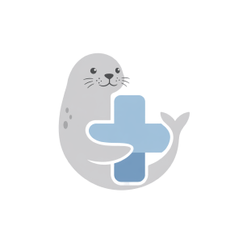
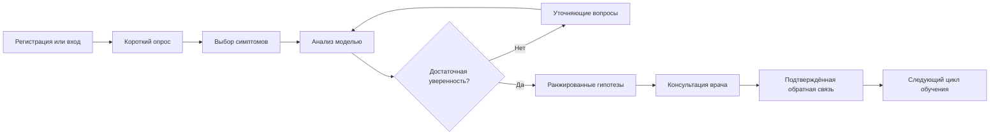
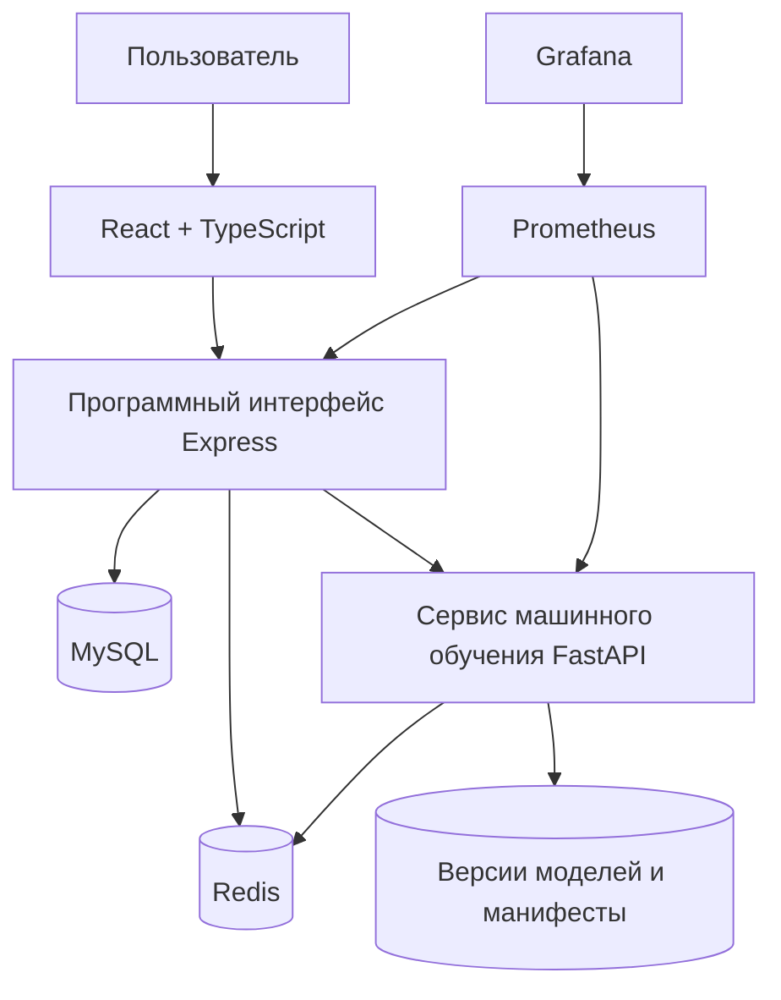

<div align="center">
  

  # Sealara

  ### Интеллектуальная система поддержки медицинской диагностики

  Sealara помогает структурировать симптомы, пройти адаптивный опрос  
  и подготовиться к консультации с профильным специалистом.

  
  
  
  
  

  **Адаптивный интерфейс · строгая типизация · машинное обучение · тесты · контейнеризация**
</div>

> [!IMPORTANT]
> Sealara — учебный проект и система поддержки принятия решений. Результаты не являются медицинским диагнозом и не заменяют консультацию врача.

---

## О проекте

Sealara — не просто демонстрационная страница, а законченное полнофункциональное приложение. Пользователь регистрируется, отвечает на вопросы о самочувствии, уточняет симптомы и получает ранжированный список возможных заболеваний. При низкой уверенности модель задаёт дополнительные вопросы, а подтверждённая врачом обратная связь может использоваться для последующего переобучения.

Проект показывает навыки разработки продукта целиком: от отзывчивого интерфейса и клиентской маршрутизации до защищённого программного интерфейса, работы с базами данных, наблюдаемости и автоматических проверок.

### Главные возможности

- 🩺 **Адаптивная диагностика** — следующий вопрос зависит от уже полученных ответов.
- 🧠 **Модель машинного обучения** — ансамбль на основе случайного леса ранжирует гипотезы и оценивает неопределённость.
- 📚 **Энциклопедия заболеваний** — поиск и подробные карточки на основе подготовленного каталога.
- 👩‍⚕️ **Контур врача** — просмотр результатов, подтверждение гипотез и передача обратной связи модели.
- 🔐 **Безопасная авторизация** — короткоживущий токен доступа и ротация токена обновления в `httpOnly` cookie.
- 👤 **Личный кабинет** — профиль, аватар и история недавних запросов.
- ♿ **Доступность** — управление с клавиатуры, заметный фокус, ссылка пропуска навигации и поддержка режима уменьшенного движения.
- 📱 **Адаптивность** — интерфейс рассчитан на настольные и мобильные экраны.

---

## Сценарий пользователя



---

## Технологии

| Область | Инструменты | Что реализовано |
|---|---|---|
| Интерфейс | React 19, TypeScript, React Router | Маршруты, формы, состояния загрузки и ошибок, адаптивная вёрстка |
| Сборка | Webpack 5 | Разделение кода, отдельный пакет зависимостей, хеши содержимого, карты исходного кода |
| Сервер | Node.js, Express 5 | Авторизация, диагностика, профиль, врачебный контур, проксирование запросов к модели |
| Данные | MySQL, Redis | Пользователи, сессии, история, обратная связь, кеш и очереди |
| Машинное обучение | Python, FastAPI, scikit-learn | Обучение, прогнозирование, уточнение симптомов и версионирование моделей |
| Безопасность | JWT, Helmet, Joi, ограничение частоты запросов | Ротация сессий, проверка отпечатка клиента, валидация и аудит событий |
| Наблюдаемость | Prometheus, Grafana, Pino | Метрики, структурированные журналы и готовая панель мониторинга |
| Проверки | Jest, Supertest, pytest | Модульные, интеграционные и сквозные сценарии |
| Инфраструктура | Docker Compose, автоматические проверки | Воспроизводимый запуск полного окружения и проверки при изменениях |

---

## Архитектура



### Как проходит диагностика

1. Клиент отправляет ответы и выбранные симптомы серверу.
2. Сервер проверяет входные данные и обращается к сервису модели.
3. Модель нормализует признаки и рассчитывает вероятности заболеваний.
4. При высокой неопределённости система предлагает наиболее информативные уточняющие симптомы.
5. Подтверждение врача сохраняется в базе и передаётся в контур обратной связи.
6. Новая версия модели публикуется через Redis; остальные экземпляры безопасно обновляют состояние.

### Структура клиентской части

```text
src/
├── components/           переиспользуемые компоненты и границы ошибок
├── pages/                маршрутные экраны и локальные стили
├── lib/auth-api.ts       типизированный слой запросов
├── data/                 подготовленные данные энциклопедии
├── images/               оптимизированные изображения
├── styles/               общие стили и оболочка страниц
└── index.tsx             маршрутизация, ленивые экраны и точка входа
```

Код каждого экрана загружается отдельным фрагментом. Зависимости React вынесены в стабильный пакет, а имена производственных файлов содержат хеш содержимого — браузер может долго кешировать неизменившиеся ресурсы.

---

## Быстрый запуск

### Вариант 1 — серверное окружение в контейнерах

Потребуются Docker и Docker Compose.

```bash
cp .env.example .env
docker compose up --build
```

Контейнеры поднимут MySQL, Redis, сервер, модель и средства наблюдаемости. Клиентскую часть запустите в соседнем терминале:

```bash
npm ci
npm run dev
```

Интерфейс будет доступен на [localhost:5173](http://localhost:5173), а служебные адреса — ниже:

| Сервис | Адрес |
|---|---|
| Серверный интерфейс | [localhost:3001/api/health](http://localhost:3001/api/health) |
| Документация запросов | [localhost:3001/api-docs](http://localhost:3001/api-docs) |
| Сервис модели | [localhost:8001/health](http://localhost:8001/health) |
| Метрики Prometheus | [localhost:9090](http://localhost:9090) |
| Панель Grafana | [localhost:3002](http://localhost:3002) |

Для остановки:

```bash
docker compose down
```

### Вариант 2 — локальная разработка

Потребуются Node.js 20+, Python 3.11+, MySQL и Redis.

```bash
# Зависимости клиентской и серверной частей
npm ci

# Изолированное окружение Python
python3 -m venv .venv
source .venv/bin/activate
python3 -m pip install -r ml-service/requirements.txt

# Настройки окружения
cp .env.example .env

# Модель, сервер и интерфейс одной командой
npm run dev:full
```

Интерфейс разработки откроется по адресу [localhost:5173](http://localhost:5173).

> [!CAUTION]
> Перед производственным запуском обязательно замените `JWT_SECRET` и `ML_API_KEY`, а также проверьте настройки базы данных, Redis, доверенного прокси и политики безопасности содержимого.

---

## Команды разработки

| Команда | Назначение |
|---|---|
| `npm run dev` | Запустить клиентскую часть с горячим обновлением |
| `npm run dev:full` | Запустить модель, сервер и клиентскую часть |
| `npm run build` | Создать оптимизированную сборку Webpack |
| `npm run preview` | Проверить производственную сборку локально |
| `npm run typecheck` | Проверить строгую типизацию TypeScript |
| `npm run test:node` | Запустить проверки серверной части |
| `npm run test:ml` | Запустить проверки модели |
| `npm run test:integration` | Запустить интеграционные сценарии |
| `npm run check` | Выполнить типизацию, серверные проверки и сборку |
| `npm run optimize:images` | Пересобрать изображения WebP |

Также доступны короткие команды:

```bash
make up       # поднять контейнеры
make down     # остановить контейнеры
make logs     # показать журналы
make ps       # показать состояние сервисов
make health   # проверить работоспособность
make test     # запустить проверки
```

---

## Проверки и качество

Проект содержит несколько уровней автоматической проверки:

- **Строгая типизация** всей клиентской части.
- **Модульные проверки** серверных утилит, безопасности, валидации и обработки изображений.
- **Проверки модели**: признаки, нормализация, информационная ценность симптомов, прогнозирование и целостность версий.
- **Интеграционные сценарии** с MySQL, Redis и сервисом модели.
- **Сквозной сценарий**: регистрация → прогноз → подтверждение врачом → обратная связь модели.
- **Проверка контракта** между сервером Node.js и сервисом FastAPI.
- **Автоматический конвейер** для запросов на слияние, основной ветки и ночных прогонов.

```bash
npm run typecheck
npm run test:node
npm run test:ml
npm run build
```

---

## Инженерные решения

### Надёжность

- Сервис модели изолирован от серверного интерфейса и взаимодействует с ним по явному контракту.
- Для вызовов модели применяется автоматический предохранитель от каскадных отказов.
- Непереданная обратная связь помещается в очередь Redis и может быть повторена позже.
- Версии моделей хранятся отдельно и проверяются по SHA-256 перед загрузкой.

### Безопасность

- Токен доступа ограничен по времени жизни.
- Токен обновления хранится в `httpOnly` cookie и ротируется при использовании.
- Проверяется отпечаток клиента; подозрительные события попадают в журнал аудита.
- Для чувствительных маршрутов действуют отдельные ограничения частоты запросов.
- Заголовки безопасности и политика источников содержимого настраиваются через окружение.

### Производительность интерфейса

- Маршрутные экраны загружаются лениво.
- Webpack разделяет прикладной код и зависимости.
- Файлы получают хеш содержимого для эффективного кеширования.
- Иллюстрации переведены в WebP: их общий вес уменьшен примерно с **2,4 МБ до 235 КБ**.
- Анимации отключаются, если пользователь выбрал уменьшенное движение.

### Наблюдаемость

- Сервер и модель публикуют метрики Prometheus.
- Grafana автоматически получает готовую панель Sealara.
- Сервер ведёт структурированные журналы и аудит событий авторизации.

---

## Настройка окружения

Полный перечень параметров находится в [`.env.example`](./.env.example). Основные группы:

| Область | Параметры |
|---|---|
| Сервер | `PORT`, `FRONTEND_ORIGIN`, `PUBLIC_API_URL`, `NODE_ENV` |
| Авторизация | `JWT_SECRET`, `ACCESS_TOKEN_TTL`, `REFRESH_TOKEN_TTL_DAYS` |
| База данных | `DB_HOST`, `DB_PORT`, `DB_USER`, `DB_PASSWORD`, `DB_NAME` |
| Redis | `REDIS_URL`, параметры очередей и повторных подключений |
| Модель | `ML_SERVICE_URL`, `ML_API_KEY`, `CONFIDENCE_THRESHOLD`, `RF_N_ESTIMATORS` |
| Безопасность | ограничения частоты запросов, CSP, COEP и доверенный прокси |
| Хранение моделей | `MODELS_DIR`, число сохраняемых версий и ключи состояния |

---

## Если что-то не запускается

<details>
<summary><strong>Порт уже занят</strong></summary>

Проверьте процессы на портах `5173`, `3001`, `8001`, `3306` и `6379`:

```bash
lsof -i :3001
```

</details>

<details>
<summary><strong>Сервер не видит сервис модели</strong></summary>

Проверьте совпадение `ML_API_KEY`, значение `ML_SERVICE_URL` и состояние сервиса:

```bash
curl http://localhost:8001/health
```

</details>

<details>
<summary><strong>Нет подключения к MySQL или Redis</strong></summary>

```bash
docker compose ps
docker compose logs db
docker compose logs redis
```

</details>

<details>
<summary><strong>Python запрещает глобальную установку пакетов</strong></summary>

Используйте изолированное окружение:

```bash
python3 -m venv .venv
source .venv/bin/activate
python3 -m pip install -r ml-service/requirements.txt
```

</details>

---

## Что проект демонстрирует работодателю

- Умение проектировать интерфейс вокруг реального пользовательского сценария.
- Уверенную работу с React, TypeScript, маршрутизацией, формами и состояниями.
- Понимание Webpack и производственной оптимизации без перехода на готовый сборщик.
- Внимание к доступности, адаптивности, безопасности и обработке ошибок.
- Способность работать с программным интерфейсом, авторизацией и серверным состоянием.
- Понимание автоматических проверок, контейнеризации и наблюдаемости.
- Опыт интеграции клиентского приложения со сложным серверным и аналитическим контуром.

---

<div align="center">
  <strong>Sealara</strong><br />
  Учебный проект, созданный с вниманием к интерфейсу, архитектуре и качеству кода.
</div>
